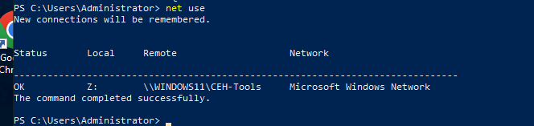
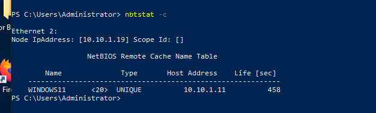
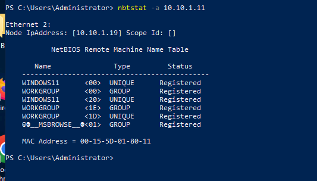
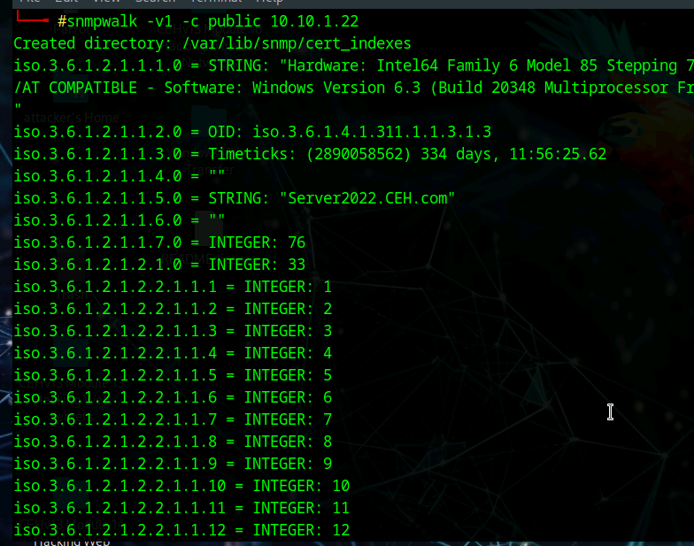
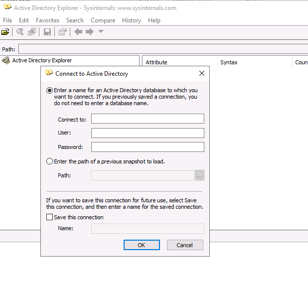
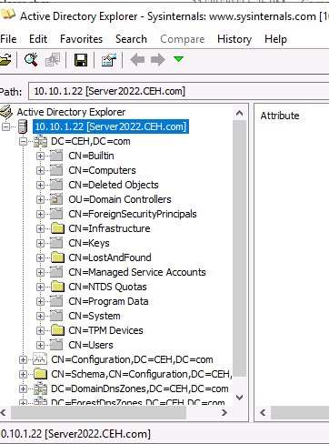
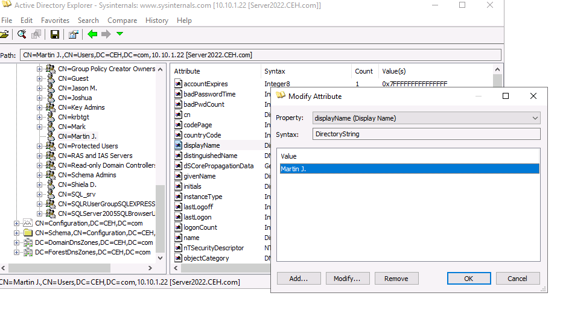
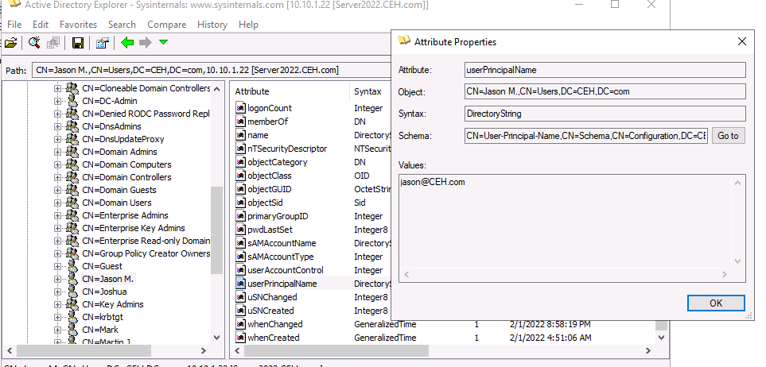

# 🧾 Lab 01: NetBIOS, SNMP, and LDAP Enumeration

## 🎯 Objective
Perform enumeration against target systems using:
- NetBIOS enumeration
- SNMP enumeration
- LDAP enumeration

The goal is to identify hostnames, shares, user account data, directory structure, and device information that could help an attacker or defender better understand the environment.

---

## 🧠 Concept

Enumeration goes beyond simple scanning.

At this stage, the objective is to pull useful information from services that are already exposed, such as:
- NetBIOS for hostnames and shares
- SNMP for device and system information
- LDAP for directory objects, users, and attributes

This phase often reveals the most valuable operational details in a target environment.

---

# 🖥️ 1. NetBIOS Enumeration

NetBIOS enumeration helps identify:
- Remote computer names
- Workgroup or domain names
- Shared resources
- Cached NetBIOS entries

---

## 📸 Net Use

**Explanation:**  
This shows a connection being made to a remote Windows share using `net use`, confirming access to a shared resource and helping identify available network paths.

---

## 📸 nbtstat Cache

**Explanation:**  
This shows cached NetBIOS entries using `nbtstat -c`, which can reveal previously resolved hostnames and associated IP addresses.

---

## 📸 nbtstat Remote Enumeration

**Explanation:**  
This output displays the NetBIOS name table for a remote host, including:
- Computer name
- Workgroup/domain name
- Service types
- MAC address

This is useful for identifying the target’s naming conventions and role in the network.

---

## 🔎 NetBIOS Findings

- Remote hostnames were identified
- Workgroup/domain naming information was revealed
- Shared resource connectivity was confirmed
- MAC address information was exposed

---

# 📡 2. SNMP Enumeration

SNMP enumeration can reveal:
- Hostnames
- System descriptions
- Uptime
- Interface counts
- Traffic and configuration details

Weak SNMP community strings can expose a large amount of operational data.

---

## 📸 snmpwalk Output

**Explanation:**  
This `snmpwalk` output reveals information from the target system including:
- Hardware/software details
- Hostname
- Uptime
- Interface-related values

This demonstrates how much information can be retrieved when SNMP is exposed and accessible.

---

## 🔎 SNMP Findings

- Hostname was identified
- Windows Server platform details were exposed
- System uptime was visible
- Network/interface data was available

---

# 🗂️ 3. LDAP Enumeration with AD Explorer

LDAP enumeration allows visibility into:
- User accounts
- Directory structure
- Object attributes
- Organizational components
- Potentially sensitive metadata

AD Explorer provides a graphical way to inspect Active Directory objects and attributes.

---

## 📸 AD Explorer Connection

**Explanation:**  
This shows the initial connection window for AD Explorer, used to connect to the target Active Directory database.

---

## 📸 AD Explorer Directory View

**Explanation:**  
This view shows the domain tree and directory structure, including containers such as:
- Users
- Builtin
- System
- Configuration
- Schema

This helps map the AD environment and identify important locations for further investigation.

---

## 📸 Attribute Modification View

**Explanation:**  
This screenshot shows attribute-level visibility within a user object. In this case, the `displayName` attribute is being viewed or modified, demonstrating how AD Explorer exposes detailed object metadata.

---

## 📸 User Principal Name Attribute

**Explanation:**  
This screenshot shows the `userPrincipalName` attribute for a domain user account. Attributes like this can reveal:
- Login naming format
- Domain suffixes
- User identity conventions

---

## 🔎 LDAP Findings

- User account attributes were visible
- Domain and container structure was mapped
- Active Directory object metadata was accessible
- Naming conventions for accounts and UPNs were exposed

---

# 🛡️ Security Insight

Enumeration can expose valuable information without exploiting anything directly.

Attackers can use this data to:
- Build user and host lists
- Identify administrative systems
- Discover naming conventions
- Map directory structure
- Prepare for password attacks, phishing, or privilege escalation

Services like SNMP, NetBIOS, and LDAP should be carefully restricted and monitored.

---

# 🧾 Key Takeaways

- NetBIOS reveals host, share, and naming information
- SNMP can expose deep system and network details
- LDAP provides insight into users, directory structure, and object attributes
- Enumeration is one of the most valuable stages of an assessment

---

# 💼 Real-World Application

**SOC Analyst**  
Detects suspicious enumeration activity and repeated information-gathering behavior.

**Security Analyst**  
Assesses how much information is exposed through internal services.

**Penetration Tester**  
Uses enumeration to map users, systems, and services before exploitation.

**IT / Help Desk**  
Benefits from understanding shares, hostnames, directory objects, and domain structure.

---

# 🚀 Final Insight

> Scanning tells you what is exposed. Enumeration tells you what it means.

This lab shows how exposed services can reveal the structure, identity, and operational details of an environment long before exploitation begins.
