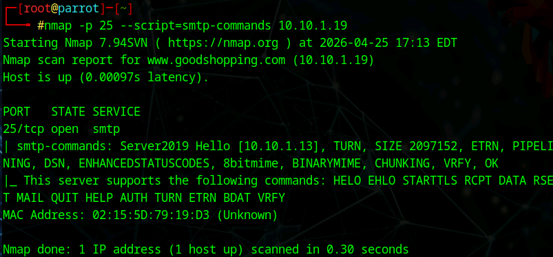
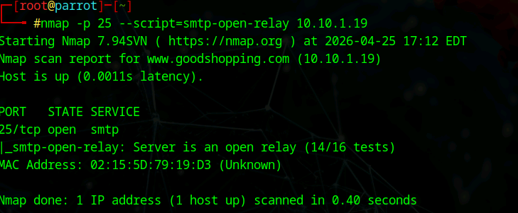
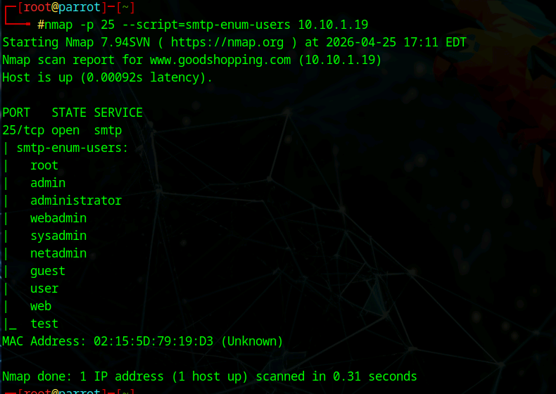
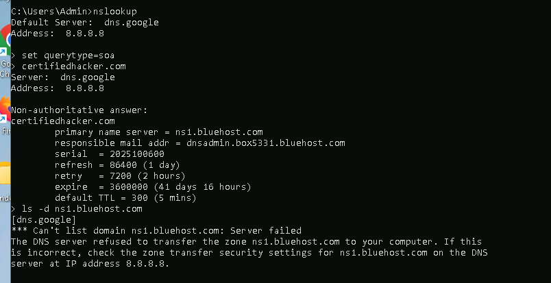
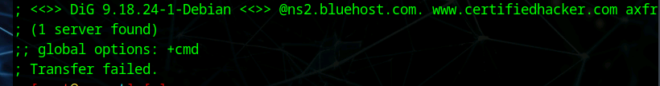
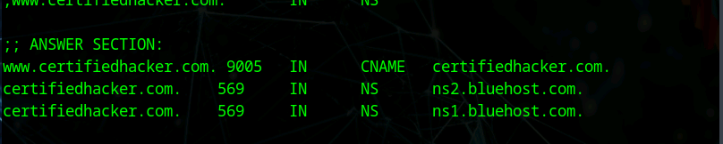
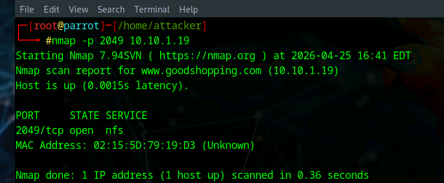
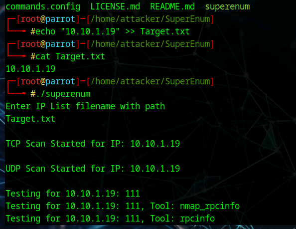
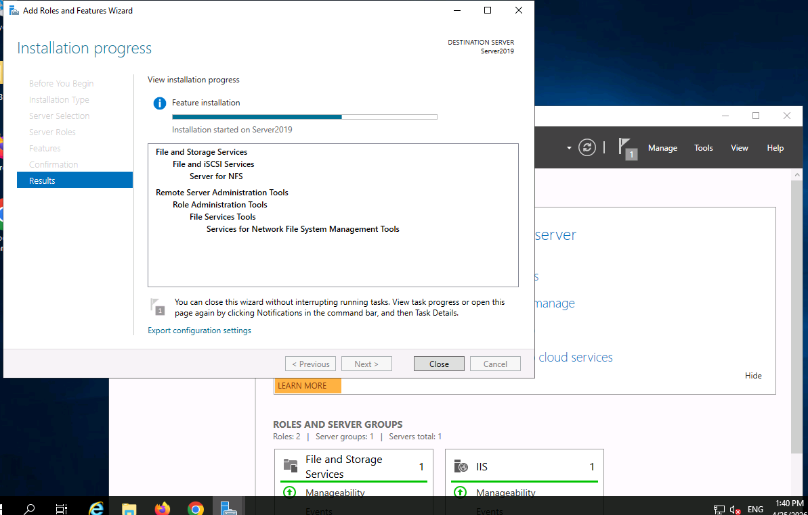

# 🧾 Lab 02: NFS, DNS, and SMTP Enumeration

## 🎯 Objective
Perform enumeration using:
- NFS Enumeration
- DNS Enumeration
- SMTP Enumeration

The goal is to extract useful information such as:
- Shared resources (NFS)
- DNS records and misconfigurations
- Email users and SMTP vulnerabilities

---

## 🧠 Concept

Enumeration focuses on extracting **meaningful data** from exposed services.

These services often reveal:
- Internal infrastructure
- User accounts
- Misconfigurations
- Potential attack paths

---

# 📡 1. SMTP Enumeration

SMTP enumeration allows discovery of:
- Supported mail commands
- Valid users
- Open relay misconfigurations

---

## 📸 SMTP Commands

**Explanation:**  
This scan reveals supported SMTP commands such as:
- HELO / EHLO
- STARTTLS
- VRFY
- AUTH

These indicate server capabilities and potential attack surfaces.

---

## 📸 Open Relay Check

**Explanation:**  
This confirms the server is configured as an **open relay**, which allows unauthorized email forwarding — a serious security issue.

---

## 📸 User Enumeration

**Explanation:**  
This reveals valid usernames such as:
- admin
- root
- user
- test

Useful for password attacks or phishing campaigns.

---

## 🔎 SMTP Findings

- SMTP service exposed on port 25
- Valid usernames discovered
- Open relay vulnerability detected
- Server capabilities identified

---

# 🌐 2. DNS Enumeration

DNS enumeration helps uncover:
- Domain structure
- Name servers
- Host records
- Misconfigurations (zone transfers)

---

## 📸 nslookup SOA Query

**Explanation:**  
This reveals:
- Primary name server
- Admin email
- DNS timing configurations

---

## 📸 Zone Transfer Attempt

**Explanation:**  
Zone transfer attempt failed — meaning the DNS server is properly restricting unauthorized transfers.

---

## 📸 DNS Records

**Explanation:**  
Displays:
- Name servers (NS records)
- CNAME mappings

Useful for mapping domain infrastructure.

---

## 🔎 DNS Findings

- Name servers identified
- Domain structure partially mapped
- Zone transfer blocked (secure configuration)

---

# 📁 3. NFS Enumeration

NFS enumeration helps identify:
- Shared directories
- Accessible resources
- Potential file exposure

---

## 📸 NFS Port Scan

**Explanation:**  
Port 2049 (NFS) is open, confirming the presence of NFS services.

---

## 📸 SuperEnum Scan

**Explanation:**  
SuperEnum automates:
- TCP scans
- UDP scans
- RPC checks

Helping identify exposed services and shares.

---

## 📸 NFS Installation

**Explanation:**  
Shows NFS role installation on the server, confirming service configuration.

---

## 🔎 NFS Findings

- NFS service detected
- RPC/NFS-related services identified
- Potential for shared resource exposure

---

# 🛡️ Security Insight

Misconfigured services can expose critical information:

- **SMTP**
  - Open relays enable spam and abuse
  - User enumeration aids credential attacks

- **DNS**
  - Zone transfers can reveal full infrastructure
  - Misconfigured records expose internal systems

- **NFS**
  - Shared directories may leak sensitive data
  - Weak permissions can allow unauthorized access

---

# 🧾 Key Takeaways

- Enumeration reveals real-world attack paths
- SMTP can expose users and misconfigurations
- DNS can map an entire environment if misconfigured
- NFS can expose internal file systems

---

# 💼 Real-World Application

**SOC Analyst**
- Detects enumeration activity and abnormal queries

**Security Engineer**
- Hardens exposed services and configurations

**Penetration Tester**
- Uses enumeration to identify attack vectors

---

# 🚀 Final Insight

> Enumeration is where attackers turn access into understanding.

This lab reinforced how critical it is to properly secure services like SMTP, DNS, and NFS to prevent information leakage.
