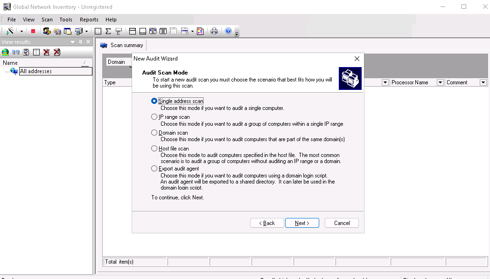
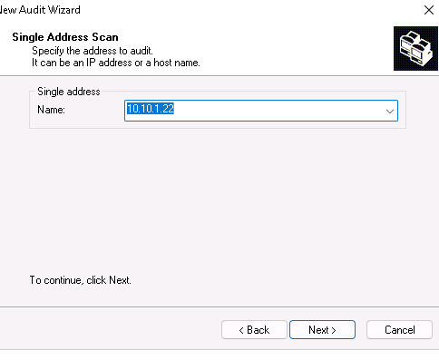
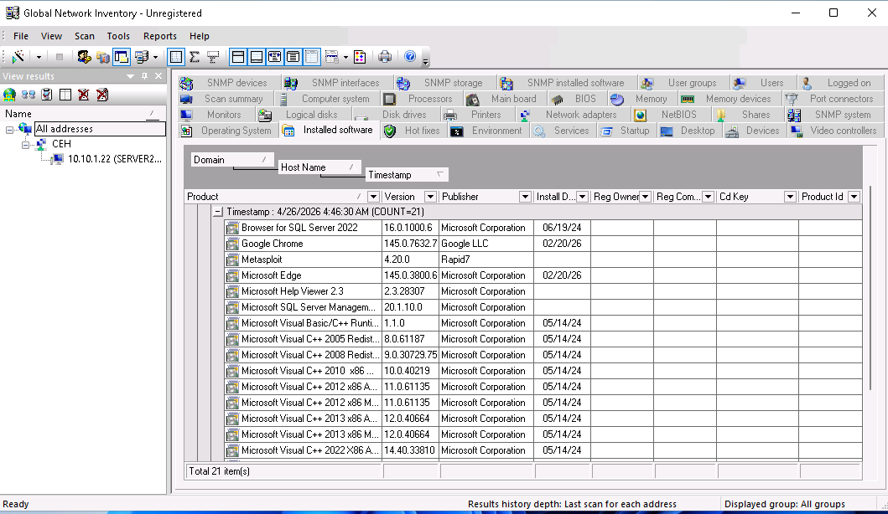
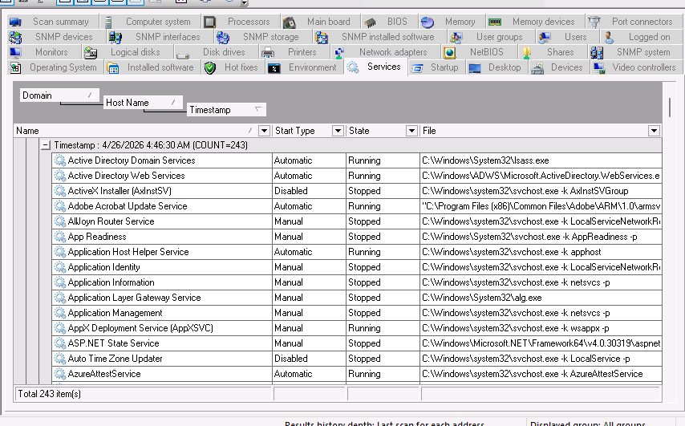
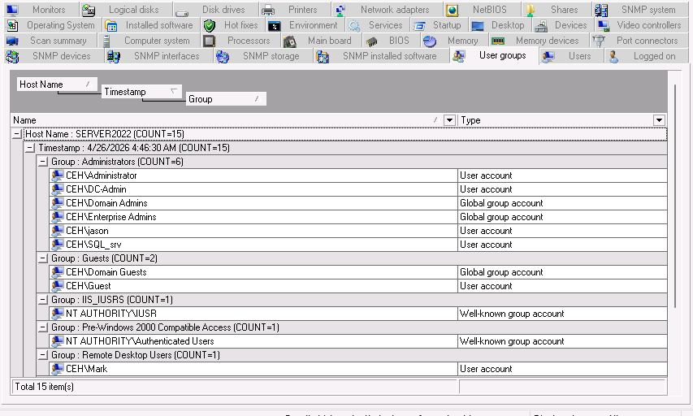
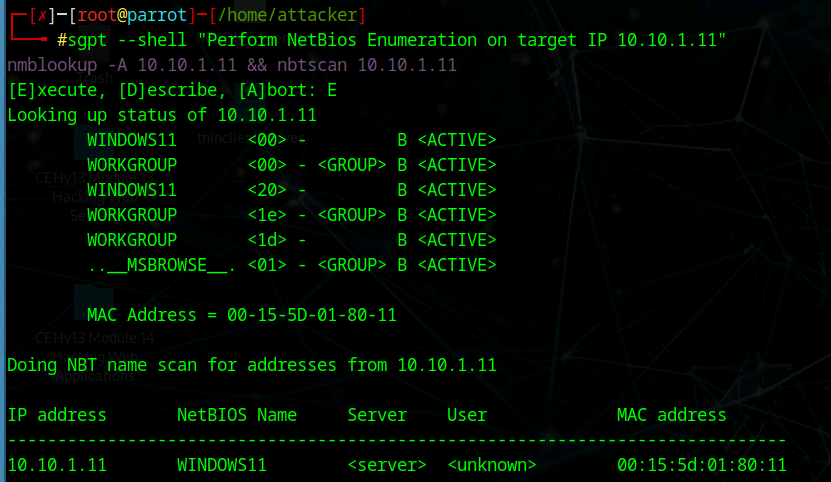
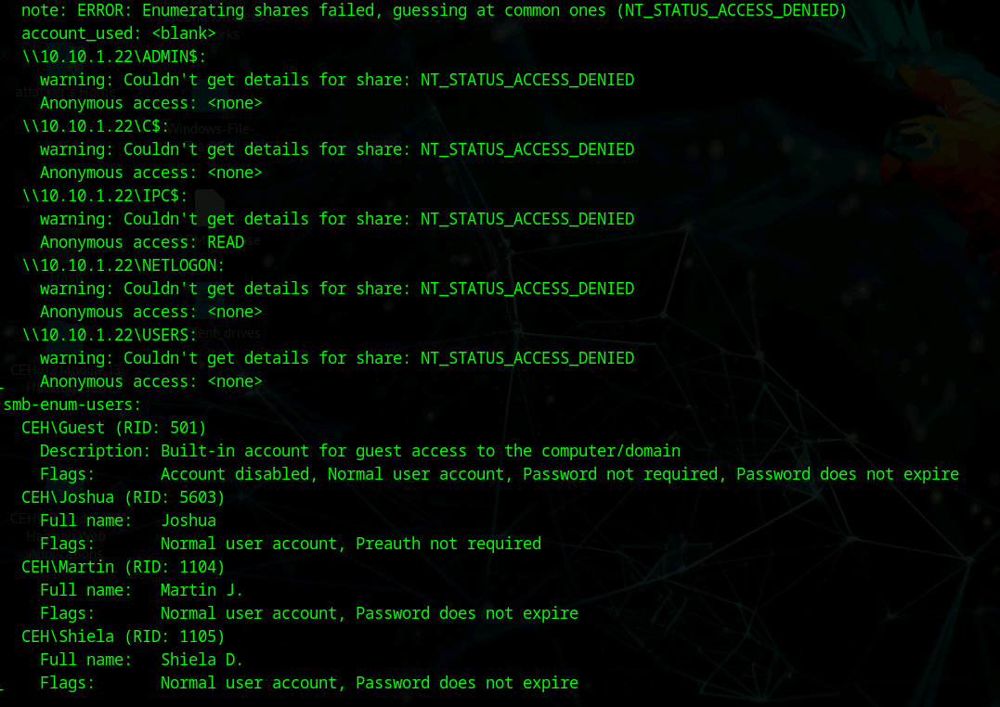
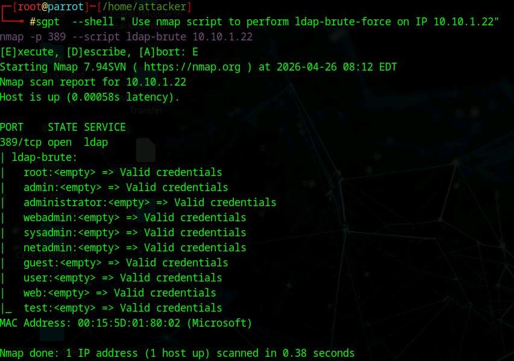
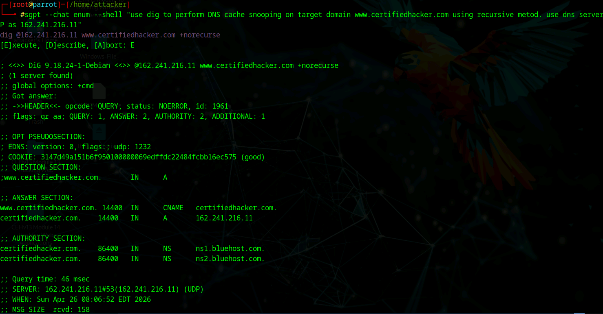
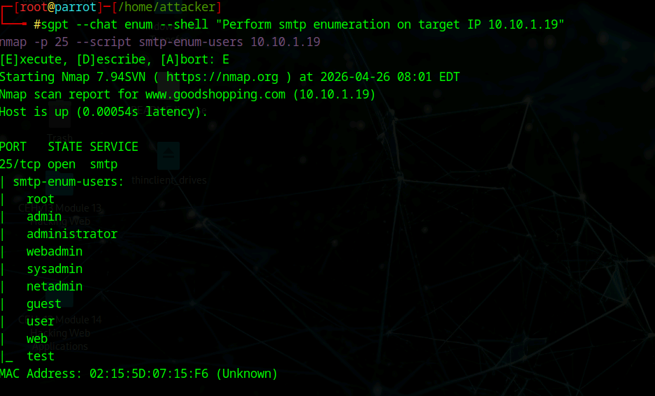

# 🧪 Lab: Enumeration using Global Network Inventory & AI (ShellGPT)

## 🎯 Objective
- Perform detailed enumeration using Global Network Inventory
- Leverage AI (ShellGPT) to automate enumeration tasks
- Gather information about:
  - Users
  - Services
  - Installed software
  - Network structure
  - Potential vulnerabilities

---

## 🛠️ Tools Used
- Global Network Inventory
- Nmap
- ShellGPT (sgpt)
- NetBIOS utilities
- SMB enumeration scripts
- DNS tools (dig, nslookup)
- SMTP enumeration scripts
- LDAP scripts

---

## 🌐 Lab Environment
- Target Network: `10.10.1.0/24`
- Target System: `10.10.1.22`
- Domain: `CEH.com`

---

## 📌 Part 1: Global Network Inventory Enumeration

### 🔹 Steps Performed
- Connected to target system using admin credentials
- Performed audit scan
- Enumerated:
  - Installed software
  - Services
  - User accounts
  - Groups

### 📸 Screenshots

---

## 🤖 Part 2: AI-Powered Enumeration (ShellGPT)

### 🔹 Tasks Automated
- NetBIOS Enumeration
- SMB Enumeration (users & shares)
- LDAP Enumeration
- DNS Enumeration
- SMTP Enumeration

---

### 📌 NetBIOS Enumeration

---

### 📌 SMB Enumeration

---

### 📌 LDAP Enumeration (Brute Force)

---

### 📌 DNS Enumeration

---

### 📌 SMTP Enumeration

---

## 🔍 Key Findings

- Multiple valid domain users discovered
- SMB revealed domain structure and users
- LDAP exposed accounts with weak configurations
- DNS provided infrastructure details
- SMTP enumeration identified valid usernames
- Global Network Inventory exposed:
  - Installed applications (SQL Server, browsers, tools)
  - Running services
  - Administrative accounts

---

## 🧠 Key Takeaways

- Enumeration is critical for understanding a target environment
- Combining multiple techniques provides a complete picture
- AI tools like ShellGPT significantly speed up workflows
- Manual knowledge is still required to interpret results correctly

---

## ⚠️ Notes
- All activities performed in a controlled lab environment
- For educational and ethical testing purposes only
