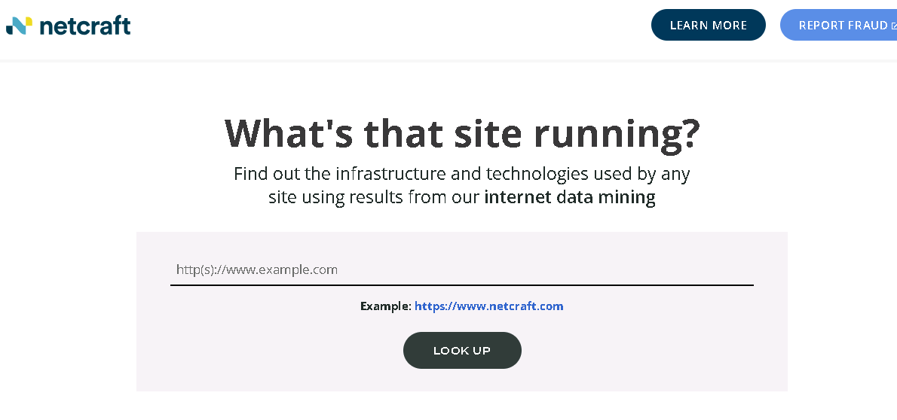
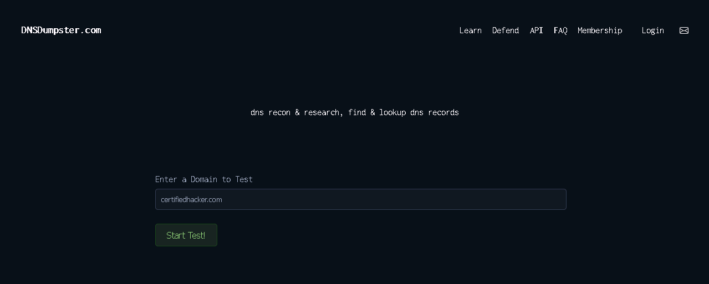
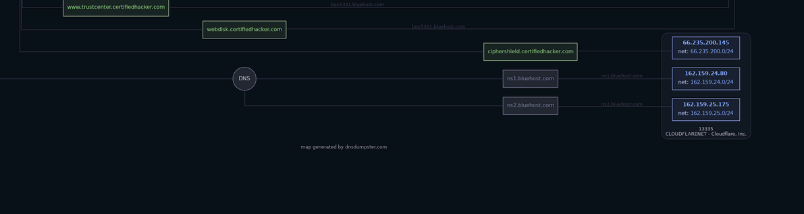
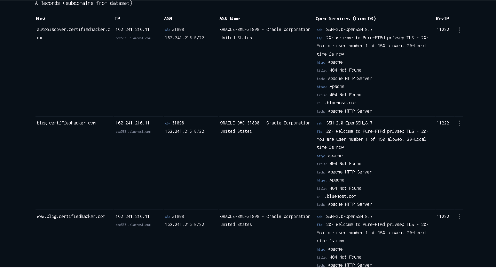

# 🌐 Lab 02: Footprinting Using Internet Research Services

## 🎯 Objective
Use public OSINT tools to gather information about a target organization’s infrastructure, including domains, subdomains, DNS records, and hosting details.

---

## 🧠 Concept
Internet research services collect and aggregate publicly available data (OSINT) to reveal:

- Subdomains
- DNS records
- Hosting providers
- Network infrastructure
- Exposed services

These tools allow both attackers and defenders to map an organization's external attack surface **without directly interacting with internal systems**.

---

## 🧪 Lab Setup

**Target:**
- certifiedhacker.com

**Tools Used:**
- Netcraft
- DNSdumpster

---

## ⚙️ Steps

### 1. Netcraft Lookup
- Go to: https://www.netcraft.com/
- Enter the target domain
- Analyze:
  - Hosting provider
  - OS
  - Netblock
  - First seen date

---

### 2. DNSdumpster Scan
- Go to: https://dnsdumpster.com
- Enter the target domain
- Run the scan
- Collect:
  - Subdomains
  - DNS servers (NS)
  - Mail servers (MX)
  - IP addresses
  - Network map

---

## 📸 Screenshots

### Netcraft Lookup

### DNSdumpster Input

### DNS Map

### DNS Records (A / MX / NS)

---

## 🔎 Findings

- **Subdomains discovered:**
  - mail.certifiedhacker.com
  - cpanel.certifiedhacker.com
  - blog.certifiedhacker.com
  - autodiscover.certifiedhacker.com

- **Hosting provider:**
  - Bluehost (Oracle infrastructure)

- **DNS servers:**
  - ns1.bluehost.com
  - ns2.bluehost.com

- **Mail server (MX):**
  - mail.certifiedhacker.com

- **Technologies identified:**
  - Apache HTTP Server
  - OpenSSH
  - Pure-FTPd

---

## 🛡️ Security Insight

This information allows attackers to:

- Identify exposed services (SSH, FTP, HTTP)
- Discover admin portals (e.g., cPanel)
- Map infrastructure and hosting providers
- Target specific systems for further enumeration

⚠️ This is powerful because:
> No direct interaction with the target is required — everything is publicly available.

---

## 🧾 Key Takeaways

- OSINT tools can reveal detailed infrastructure data
- Subdomains significantly expand the attack surface
- DNS records are critical for reconnaissance
- Third-party services can unintentionally expose sensitive information

---

## 💼 Real-World Application

**SOC Analyst**
- Detects reconnaissance behavior and monitors exposed assets

**Security Analyst**
- Performs external attack surface assessments

**Help Desk / IT**
- Understands domain structure and service dependencies

**Penetration Tester**
- Uses this data as the initial phase of engagement

---

## 🚀 Bonus Insight

Organizations should:
- Limit publicly exposed subdomains
- Use DNS hardening techniques
- Regularly audit their OSINT footprint
- Monitor external exposure using tools like Netcraft and DNSdumpster
