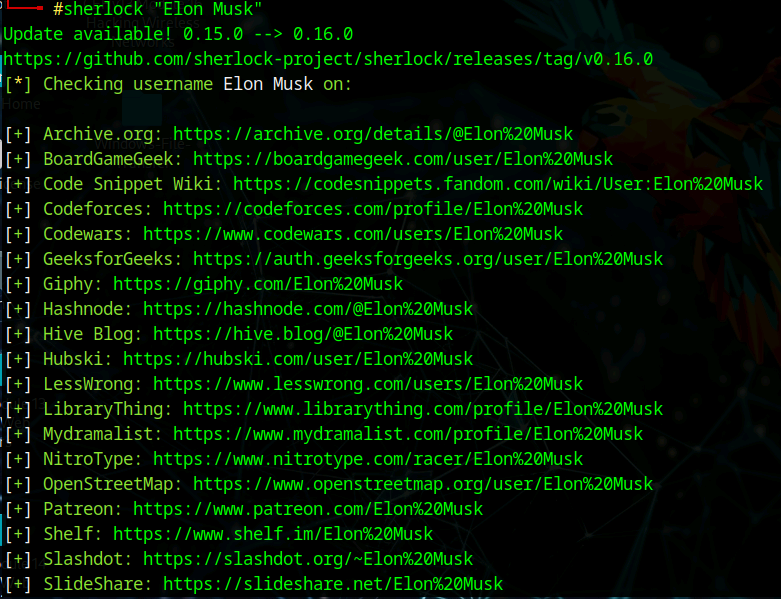
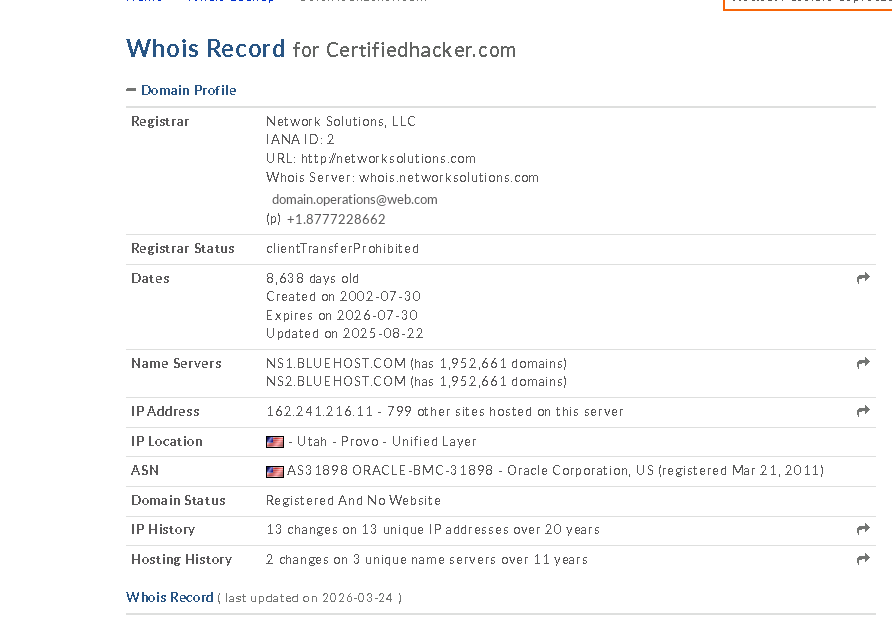
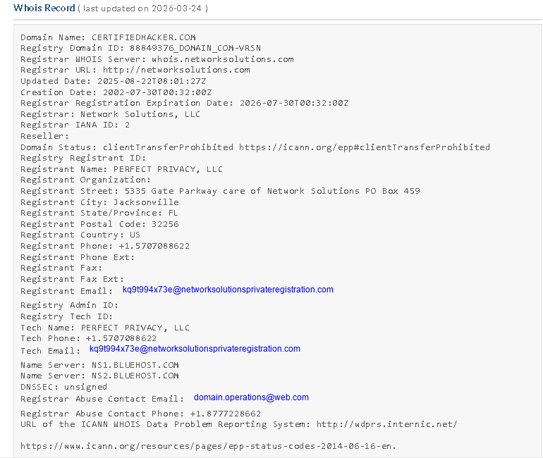
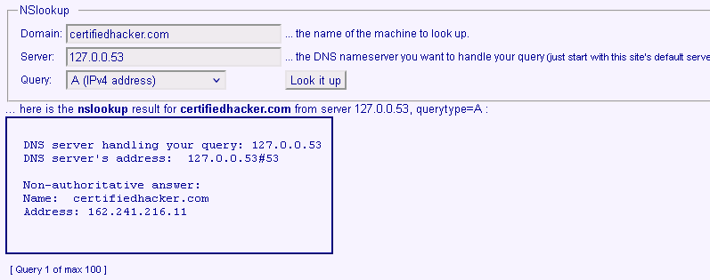
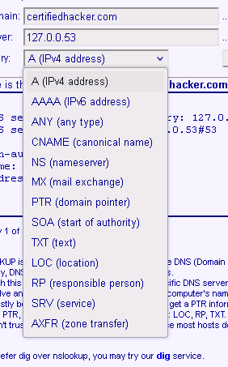

# Lab 03: Core OSINT Techniques (Social, Whois, DNS)

## Objective
Perform foundational OSINT techniques to gather information about a target using:
- Social media footprinting
- Whois lookup
- DNS enumeration

---

## Concept
Before active scanning or exploitation, attackers gather intelligence using publicly available data.

These techniques help identify:
- People and potential social engineering targets
- Domain ownership and infrastructure details
- DNS configuration and exposed services

---

## 1. Social Media Footprinting (Sherlock)

### Steps
`python3 sherlock "Elon Musk"`

### Screenshot

[Open image](../../screenshots/footprinting/03/03-sherlock.png)

**Description:**  
Sherlock checks many platforms for username matches. This helps show how one identity can be correlated across multiple services.

### Findings
- Multiple social profiles were identified
- Username reuse was visible across platforms
- Public identity exposure can support profiling

### Security Insight
Attackers use this to:
- Build social engineering profiles
- Identify high-value individuals
- Correlate identities across services

---

## 2. Whois Footprinting

### Steps
- Opened a Whois lookup tool
- Queried `certifiedhacker.com`
- Reviewed both summary and detailed registration data

### Screenshot: Whois Lookup

[Open image](../../screenshots/footprinting/03/03-whois-lookup.png)

**Description:**  
This shows the lookup interface used to retrieve domain registration and ownership-related data.

### Screenshot: Whois Summary

[Open image](../../screenshots/footprinting/03/03-whois-summary.png)

**Description:**  
This summary highlights the registrar, IP address, and general infrastructure details tied to the domain.

### Screenshot: Full Whois Record

[Open image](../../screenshots/footprinting/03/03-whois-full.png)

**Description:**  
The full record includes detailed registration information such as name servers, dates, and privacy protection details.

### Findings
- Registrar: Network Solutions, LLC
- Domain creation year: 2002
- Name servers:
  - `ns1.bluehost.com`
  - `ns2.bluehost.com`
- Privacy protection was enabled

### Security Insight
Whois data can reveal:
- Registrar and provider relationships
- Domain age and history
- Infrastructure details
- Ownership details when privacy is not enabled

---

## 3. DNS Footprinting

### Steps
- Queried DNS records for `certifiedhacker.com`
- Reviewed record types such as A, CNAME, NS, and SOA
- Used `nslookup` from the command line

Commands used:
- `nslookup`
- `set type=a`
- `www.certifiedhacker.com`
- `set type=cname`
- `set type=soa`

### Screenshot: DNS Record Types

[Open image](../../screenshots/footprinting/03/03-dns-types.png)

**Description:**  
This shows the available DNS record types that can be queried to understand how the domain is configured.

### Screenshot: DNS A Record Result

[Open image](../../screenshots/footprinting/03/03-dns-a.png)

**Description:**  
The A record maps the domain to an IP address, revealing where the site is hosted.

### Screenshot: nslookup Output

[Open image](../../screenshots/footprinting/03/03-nslookup.png)

**Description:**  
This output shows command-line DNS resolution results, including how the domain and related records resolve.

### Findings
- A record resolved to `162.241.216.11`
- `www.certifiedhacker.com` pointed to the main domain
- Name servers included:
  - `ns1.bluehost.com`
  - `ns2.bluehost.com`

### Security Insight
DNS data allows attackers to:
- Map infrastructure
- Identify dependencies and providers
- Discover targets for further enumeration

---

## Key Takeaways
- OSINT gathers useful intelligence without directly interacting with the target
- Social media can expose people and naming patterns
- Whois reveals domain and provider relationships
- DNS reveals technical architecture

---

## Real-World Application
**SOC Analyst**
- Understands early-stage reconnaissance behavior

**Security Analyst**
- Assesses external exposure and attack surface

**Help Desk / IT**
- Understands DNS behavior and domain dependencies

**Penetration Tester**
- Uses OSINT as the first phase of engagement

---

## Final Insight
Most attacks begin with reconnaissance, not exploitation.
