# 🌐 Lab 04: Network, Email, and Automated Footprinting

## 🎯 Objective
Perform active footprinting techniques to map network paths, analyze email infrastructure, and automate reconnaissance using Recon-ng.

---

# 🌍 1. Network Footprinting (Traceroute)

## ⚙️ Commands

Linux:

traceroute www.certifiedhacker.com

Windows:

tracert www.certifiedhacker.com

---

## 📸 Linux Traceroute

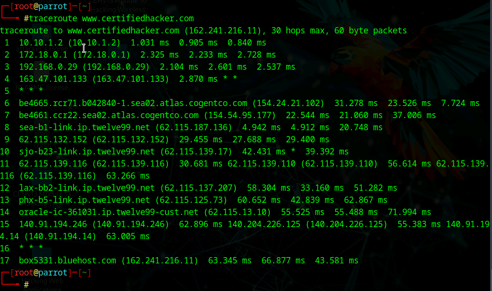

**Explanation:**  
Shows each hop between your system and the target. This reveals network providers and routing paths.

---

## 📸 Windows Traceroute

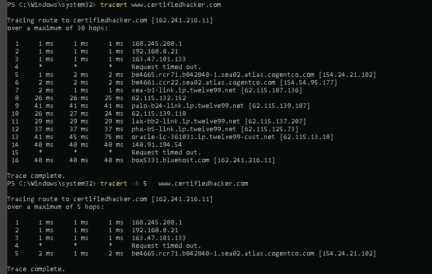

**Explanation:**  
Confirms routing path using a Windows system.

---

# 📧 2. Email Footprinting

## 📸 Email Header Analysis

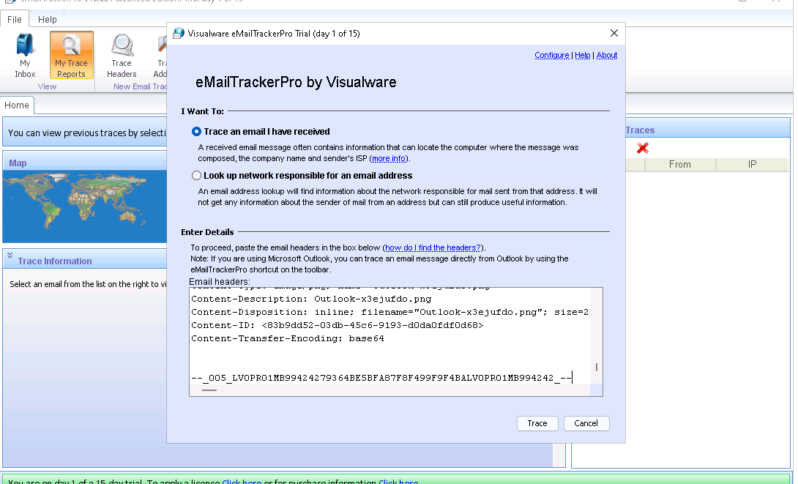

**Explanation:**  
Displays SPF, DKIM, and DMARC validation along with mail routing.

---

## 📸 Email Tracking Tool

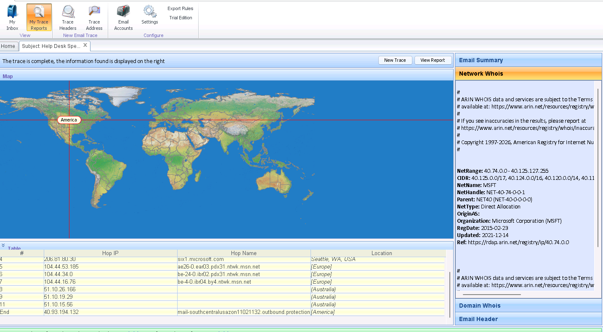

**Explanation:**  
Maps the geographic path of an email and shows relay servers.

---

# 🧠 3. Recon-ng (Automated Footprinting)

## 📸 Recon-ng Start

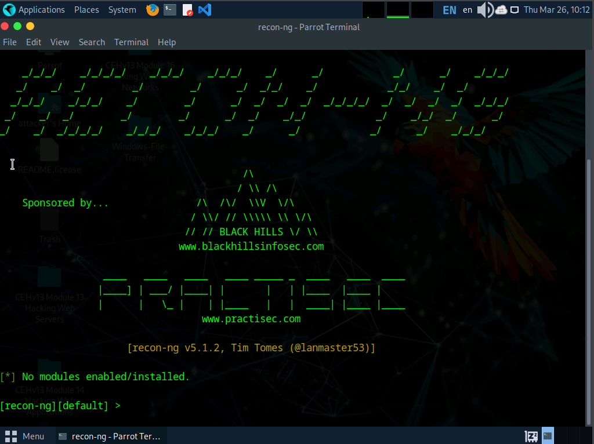

**Explanation:**  
Initial interface for Recon-ng where modules and workspaces are managed.

---

## 📸 Workspace Creation

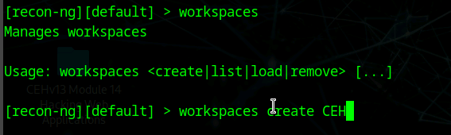

**Explanation:**  
Workspaces separate recon data per target.

---

## 📸 Domain Added

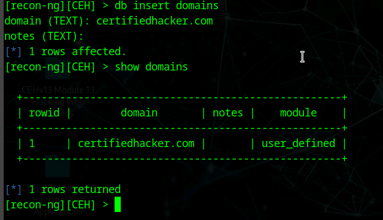

**Explanation:**  
Target domain inserted into the database.

---

## 📸 Module Execution

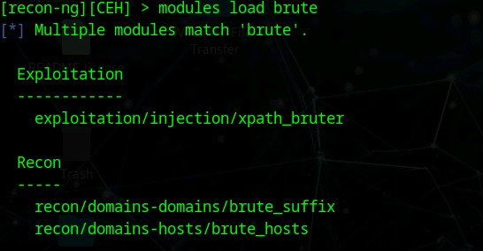

**Explanation:**  
Running modules to automate host discovery.

---

## 📸 Hosts Found

**Explanation:**  
Shows discovered subdomains and associated IPs.

---

# 🔎 Key Findings

- Multiple subdomains discovered
- Shared hosting infrastructure
- Email routing through major providers
- Network path reveals upstream ISPs

---

# 🛡️ Security Insight

These techniques allow attackers to:

- Map infrastructure
- Identify services
- Discover attack paths
- Automate reconnaissance

---

---

## 📸 Advanced Recon-ng Modules (Contact Enumeration)

### Whois Contacts Module (whois_pocs)

**Explanation:**
This module pulls contact information from ARIN Whois records, including:
- Names
- Emails
- Locations
- Organizational roles

---

### Module Execution

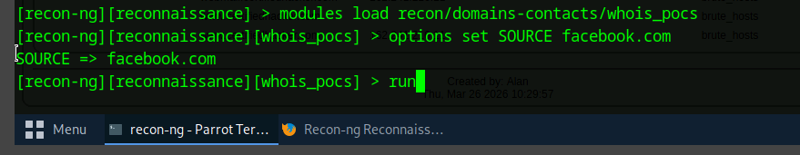

**Explanation:**
The module is configured with a target domain (`facebook.com`) and executed to gather associated contact data.

---

### Contact Data Results

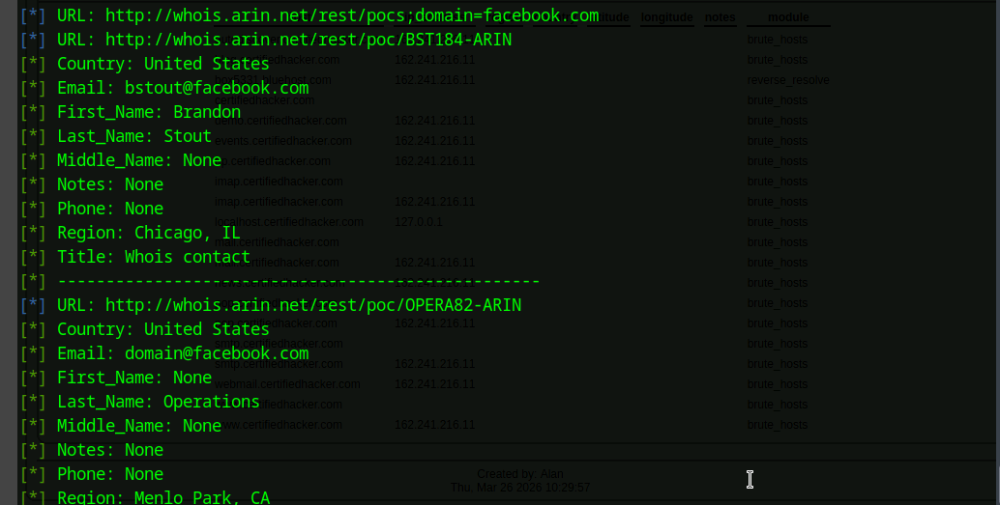

**Explanation:**
Shows extracted contact records such as:
- Email addresses (e.g., domain@facebook.com)
- Names and roles
- Geographic locations

This demonstrates how infrastructure data can be tied back to real individuals.

---

### Additional Recon-ng Output

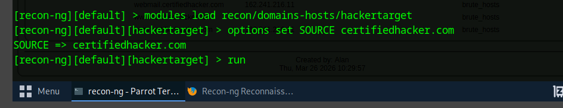

**Explanation:**
Further results showing how multiple modules can correlate and expand OSINT data across sources.

---

## 🔎 Additional Findings

- Contact information linked to infrastructure
- Organizational roles identified
- Geographic location data discovered

---

## 🛡️ Advanced Security Insight

This level of recon allows attackers to:

- Pivot from infrastructure → people
- Identify employees tied to systems
- Launch targeted phishing campaigns
- Build detailed organizational maps

⚠️ This is where OSINT becomes **dangerous** — it connects systems to humans.

---

# 🚀 Final Insight

> The more you can see without touching the system, the more dangerous reconnaissance becomes.
