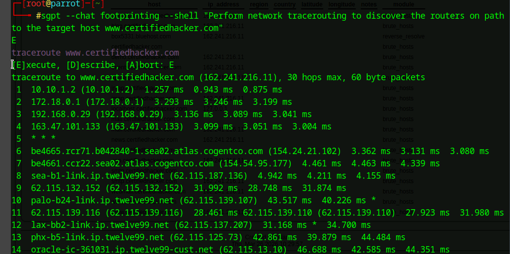
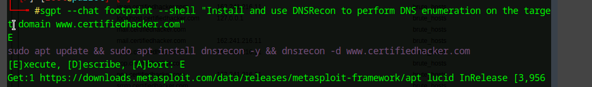
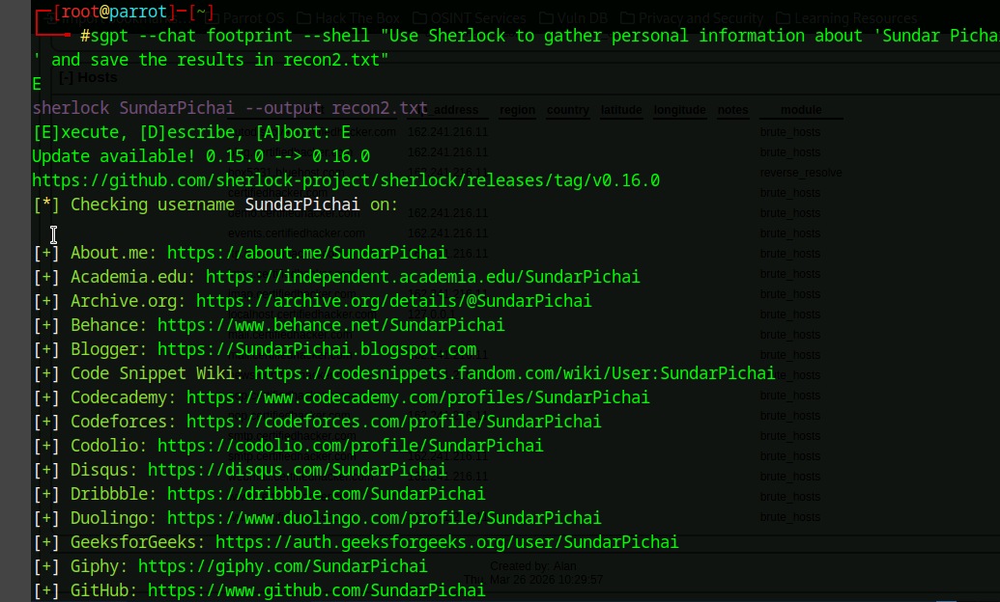

# 🤖 Lab 05: AI-Powered Footprinting with ShellGPT

## 🎯 Objective
Use AI (ShellGPT) to automate footprinting tasks such as:
- Network reconnaissance
- DNS enumeration
- OSINT collection from social platforms

---

## 🧠 Concept

ShellGPT allows you to translate natural language into real commands, enabling faster and more efficient reconnaissance.

Instead of manually typing tools and syntax, AI generates and executes commands for you.

---

# 🌐 1. AI-Generated Network Footprinting

## ⚙️ Command

sgpt --chat footprinting --shell "Perform network tracerouting to discover the routers on path to the target host www.certifiedhacker.com
"

---

## 📸 Screenshot

**Explanation:**  
ShellGPT generated a traceroute command and executed it automatically, mapping the path between the system and the target host.

---

## 🔎 Findings

- Multiple network hops identified
- External ISPs observed (Cogent, Twelve99)
- Target hosted on Bluehost infrastructure

---

# 🌐 2. AI-Driven DNS Enumeration

## ⚙️ Command

sgpt --chat footprint --shell "Install and use DNSRecon to perform DNS enumeration on the target domain www.certifiedhacker.com
"

---

## 📸 Screenshot

**Explanation:**  
ShellGPT suggested using DNSRecon and executed enumeration, revealing DNS records and configurations.

---

## 🔎 Findings

- DNSSEC not configured
- Name servers:
  - ns1.bluehost.com
  - ns2.bluehost.com
- Mail server identified
- SPF record discovered

---

# 👤 3. AI-Assisted OSINT (Sherlock)

## ⚙️ Command

sgpt --chat footprint --shell "Use sherlock to gather personal information about 'Sundar Pichai' and save the results in recon2.txt"

---

## 📸 Screenshot

**Explanation:**  
ShellGPT generated a Sherlock command to identify social media accounts and OSINT data tied to the target.

---

## 🔎 Findings

- Multiple social profiles discovered
- Username correlation across platforms
- Automated OSINT aggregation

---

# 🛡️ Security Insight

AI-powered footprinting enables:

- Faster reconnaissance
- Automation of complex workflows
- Scaling OSINT collection
- Lower barrier for attackers

⚠️ This significantly increases the speed and effectiveness of reconnaissance.

---

# 🧾 Key Takeaways

- AI can automate traditional footprinting tasks
- Natural language → command execution
- Faster recon = higher risk if unmonitored
- Combining tools increases effectiveness

---

# 💼 Real-World Application

**SOC Analyst**
- Understands automated recon techniques

**Security Analyst**
- Evaluates attack surface exposure

**Penetration Tester**
- Uses AI to accelerate engagements

**IT / Help Desk**
- Uses tools for troubleshooting and visibility

---

# 🚀 Final Insight

> AI is transforming reconnaissance into automated intelligence gathering.

Defenders must adapt as quickly as attackers.
