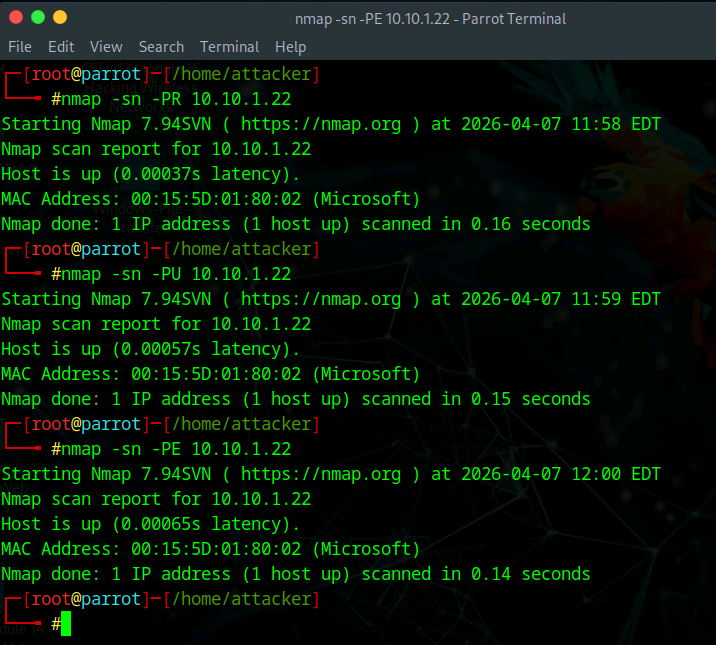
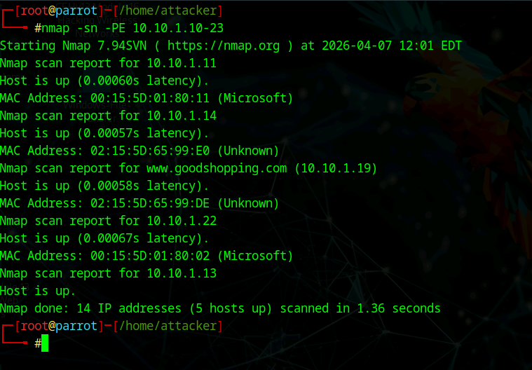
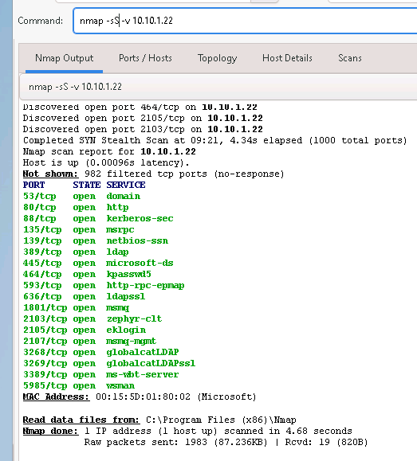
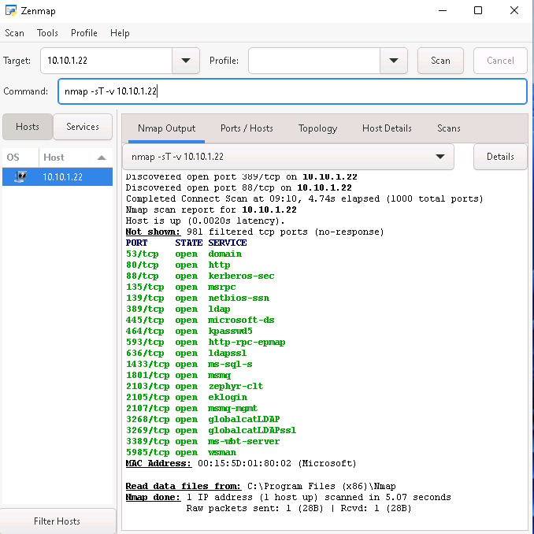
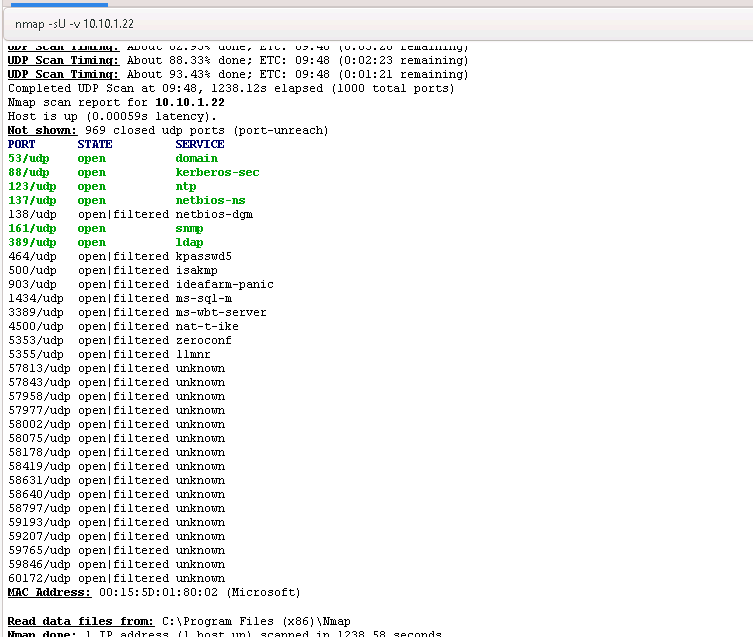
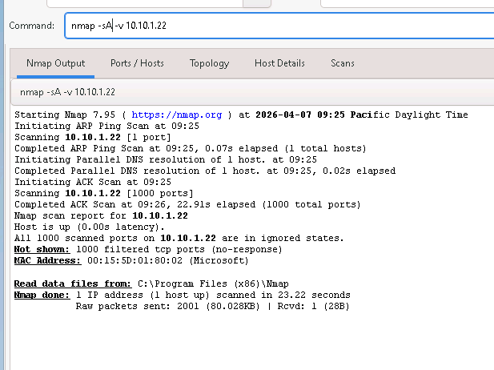
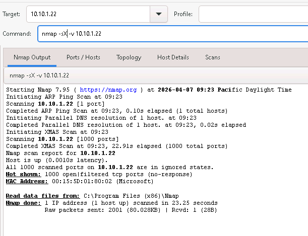
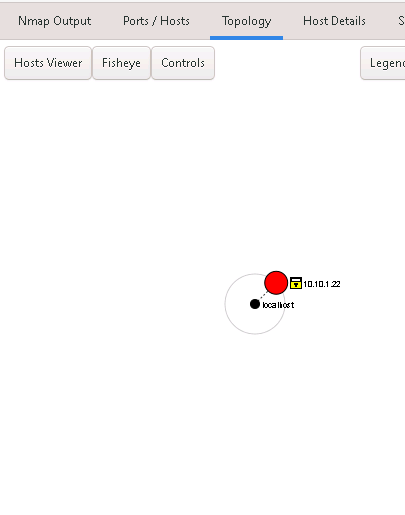
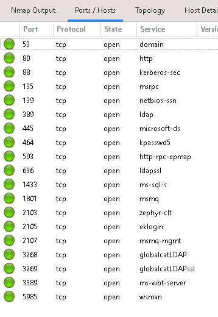

## 🧠 Concept

Nmap is one of the most powerful tools for network scanning.

It allows attackers and defenders to:
- Identify active systems
- Discover exposed services
- Map network attack surfaces

---

# 🌐 1. Host Discovery

## ⚙️ Commands Used

### ICMP / Ping Scan

nmap -sn -PE 10.10.1.10-23

### ARP Scan

nmap -sn -PR 10.10.1.22

### UDP Ping

nmap -sn -PU 10.10.1.22

---

## 📸 Host Discovery Results

**Explanation:**  
Nmap identified active hosts in the network range.  
This confirms which systems are online before deeper scanning.

---

## 📸 Multiple Discovery Techniques

**Explanation:**  
Different discovery methods (ICMP, ARP, UDP) help bypass firewall restrictions and improve accuracy.

---

## 🔎 Findings

- Multiple hosts discovered
- MAC addresses identified
- Live systems confirmed

---

# 🔓 2. Port & Service Discovery

## ⚙️ Commands Used

### TCP Connect Scan

nmap -sT -v 10.10.1.22

### SYN Scan (Stealth)

nmap -sS -v 10.10.1.22

### UDP Scan

nmap -sU -v 10.10.1.22

### ACK Scan

nmap -sA -v 10.10.1.22

### Xmas Scan

nmap -sX -v 10.10.1.22

---

## 📸 SYN Scan Results

**Explanation:**  
Stealth scan that identifies open ports without completing full TCP connections.

---

## 📸 TCP Connect Scan

**Explanation:**  
Performs a full TCP handshake, making it more detectable but reliable.

---

## 📸 UDP Scan

**Explanation:**  
Identifies UDP services such as DNS, NTP, and SNMP.

---

## 📸 ACK Scan

**Explanation:**  
Used to map firewall rules and determine filtered vs unfiltered ports.

---

## 📸 Xmas Scan

**Explanation:**  
Uses unusual packet flags to evade detection and identify open ports.

---

## 📸 Zenmap Visualization

**Explanation:**  
Graphical representation of hosts and network relationships.

---

## 📸 Open Ports View

**Explanation:**  
Displays discovered open ports and associated services.

---

## 🔎 Findings

Open ports discovered:
- 53 (DNS)
- 80 (HTTP)
- 88 (Kerberos)
- 135 (RPC)
- 139 (NetBIOS)
- 389 (LDAP)
- 445 (SMB)
- 3268 (Global Catalog)
- 5985 (WinRM)

👉 Indicates a **Windows domain environment**

---

## 🛡️ Security Insight

Nmap scanning allows attackers to:

- Identify exposed services
- Detect operating systems
- Map network structure
- Identify attack vectors

⚠️ Open ports = potential entry points

---

## 🧾 Key Takeaways

- Host discovery identifies live systems
- Port scanning reveals attack surface
- Different scan types provide different insights
- Combining techniques improves accuracy

---

## 💼 Real-World Application

**SOC Analyst**
- Detects scanning behavior

**Security Analyst**
- Identifies exposed services

**Penetration Tester**
- Uses Nmap as a primary recon tool

**IT / Help Desk**
- Troubleshoots connectivity and services

---

## 🚀 Final Insight

> You can’t secure what you don’t know is exposed.

Scanning is the foundation of both attack and defense.
