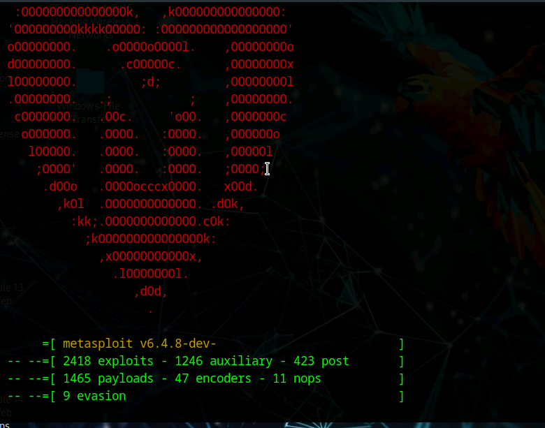
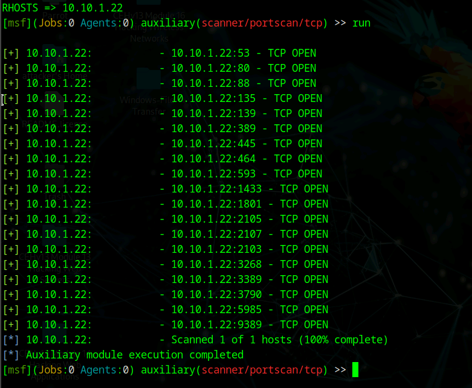
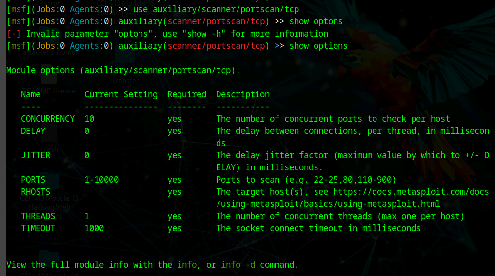
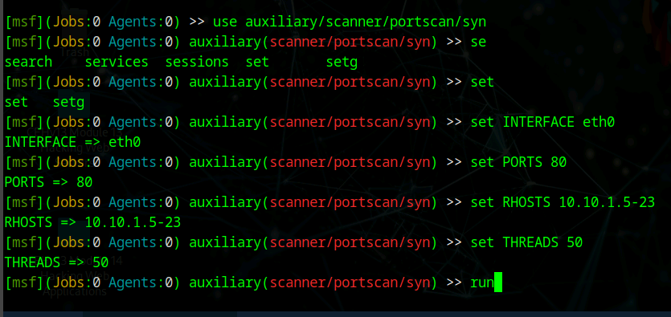
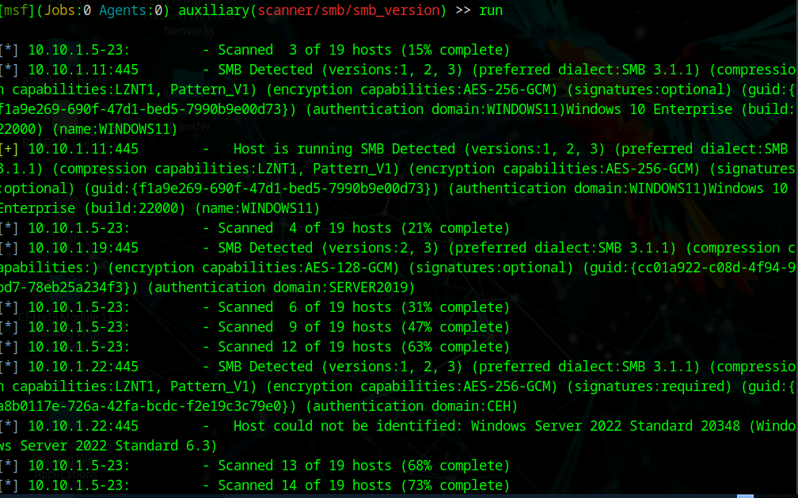
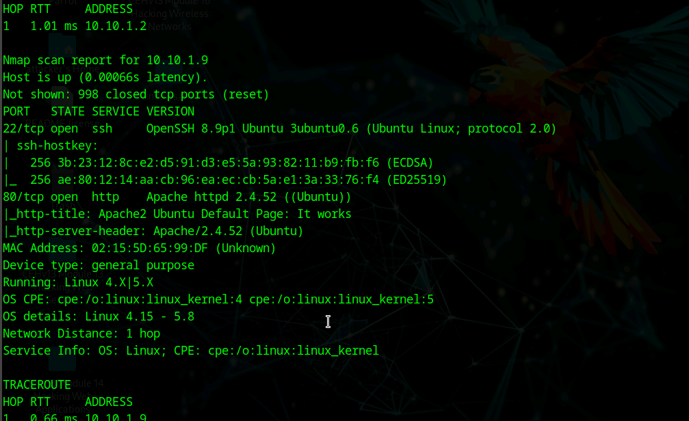
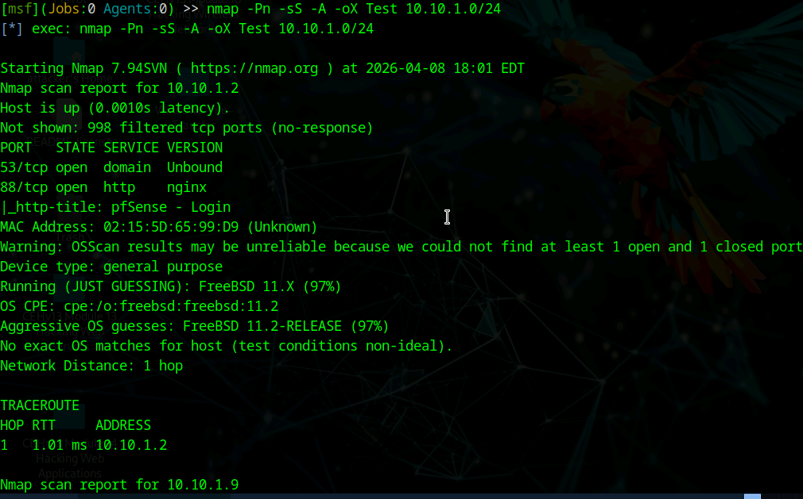

# 🚀 Lab 03: Network Scanning using Metasploit

## 🎯 Objective
Use the Metasploit Framework to:
- Scan a target network
- Identify open ports and services
- Gather OS and service information

---

## 🧠 Concept

Metasploit is not just for exploitation.

It includes powerful **auxiliary scanning modules** that allow:
- Port scanning
- Service detection
- OS fingerprinting
- Network enumeration

---

# 🧰 1. Starting Metasploit

msfconsole

## 📸 Metasploit Framework Loaded

---

# 🔍 2. TCP Port Scanning

## ⚙️ Module Used

use auxiliary/scanner/portscan/tcp
set RHOSTS 10.10.1.22
run

## 📸 TCP Port Scan Results

**Explanation:**
Metasploit identified multiple open ports:
- 53 (DNS)
- 80 (HTTP)
- 88 (Kerberos)
- 135 (RPC)
- 389 (LDAP)
- 445 (SMB)
- 1433 (MSSQL)
- 5985 (WinRM)

👉 Indicates a **Windows domain environment**

---

# ⚙️ 3. Module Options

## 📸 Scanner Options

**Explanation:**
- RHOSTS → target IP range
- PORTS → ports to scan
- THREADS → scan speed
- TIMEOUT → connection limits

---

# ⚡ 4. SYN Scan Module

## ⚙️ Module Used

use auxiliary/scanner/portscan/syn
set RHOSTS 10.10.1.5-23
set PORTS 80
run

## 📸 SYN Scan Results

**Explanation:**
Stealth scan identifies HTTP services across multiple hosts.

---

# 🖥️ 5. SMB Version Detection

## ⚙️ Module Used

use auxiliary/scanner/smb/smb_version
run

## 📸 SMB Detection

**Explanation:**
- SMB versions detected (v1, v2, v3)
- Encryption capabilities identified
- Hostnames and domains revealed

---

# 🧠 6. OS & Service Identification

## 📸 OS Detection Output

**Explanation:**
- Windows systems detected
- Linux host identified
- Service banners exposed (Apache, OpenSSH)

---

# 🔄 7. Running Nmap inside Metasploit

## ⚙️ Command

nmap -Pn -sS -A -oX Test 10.10.1.0/24

## 📸 Nmap via Metasploit

**Explanation:**
Metasploit integrates Nmap for deeper scanning and OS detection.

---

# 🔎 Findings

- Multiple hosts discovered
- Open ports across services:
  - DNS, HTTP, SMB, LDAP, MSSQL
- Windows domain environment detected
- Linux systems also identified

---

# 🛡️ Security Insight

Metasploit scanning enables attackers to:
- Map network infrastructure
- Identify vulnerable services
- Detect operating systems
- Prepare for exploitation

⚠️ Exposed services increase attack surface.

---

# 🧾 Key Takeaways

- Metasploit is powerful for reconnaissance
- Auxiliary modules provide deep visibility
- SMB and port scanning reveal critical info
- Combining tools (Nmap + MSF) is effective

---

# 💼 Real-World Application

**SOC Analyst**
- Detects scanning activity

**Security Engineer**
- Identifies exposed services

**Penetration Tester**
- Uses MSF for enumeration and exploitation

**IT Support**
- Troubleshoots network services

---

# 🚀 Final Insight

> Enumeration is where attackers gain real intelligence.

Metasploit bridges the gap between scanning and exploitation.
